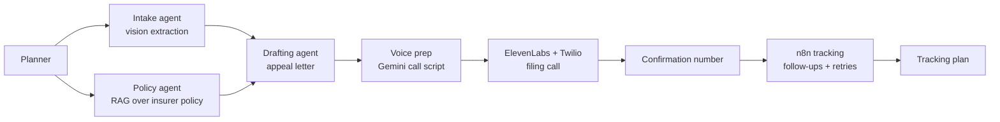

# PriorAuth Advocate

PriorAuth Advocate is an administrative advocacy copilot for insurance prior-authorization denials: a patient or advocate uploads a denial letter, Gemini agents extract the administrative facts, match the insurer policy, draft an appeal packet, ElevenLabs/Twilio places the filing call, and n8n tracks follow-ups after the confirmation number. It does not provide medical advice, diagnosis, treatment recommendations, or dosing guidance.

## Agent Graph

## Event Boundary

Code intended for the Google I/O Hackathon project starts during the May 23, 2026 build window. Anything under `pre-event/` is scaffolding, evaluation, or a disposable smoke test used to de-risk the stack before kickoff.
