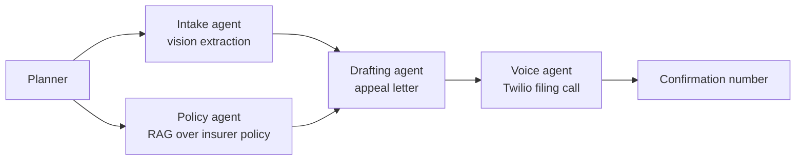

# PriorAuth Advocate

PriorAuth Advocate is an administrative advocacy copilot for insurance prior-authorization denials: a patient or advocate uploads a denial letter, a managed-agent workflow extracts the administrative facts, matches the insurer policy, drafts an appeal packet, and places a call to a fake demo insurer IVR to file it. It does not provide medical advice, diagnosis, treatment recommendations, or dosing guidance.

## Agent Graph

## Event Boundary

Code intended for the Google I/O Hackathon project starts during the May 23, 2026 build window. Anything under `pre-event/` is scaffolding, evaluation, or a disposable smoke test used to de-risk the stack before kickoff.
